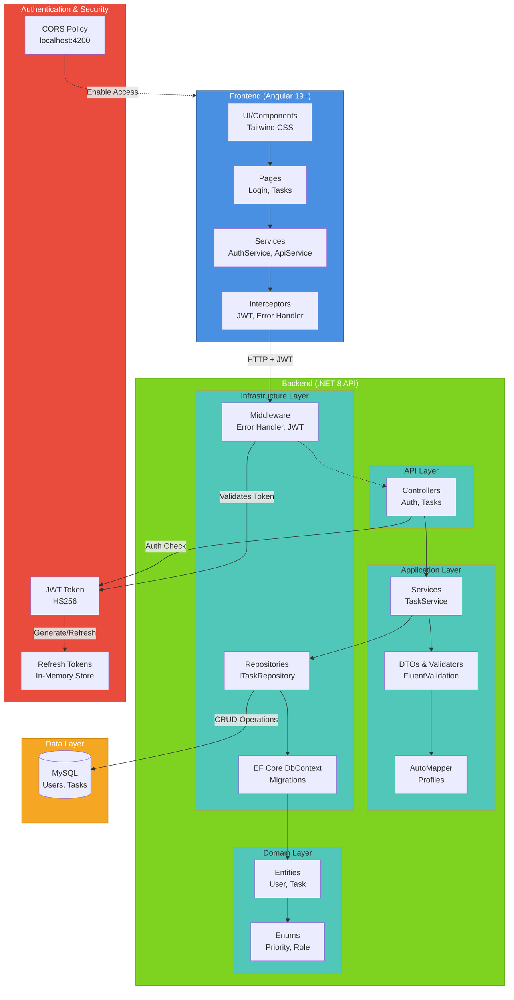
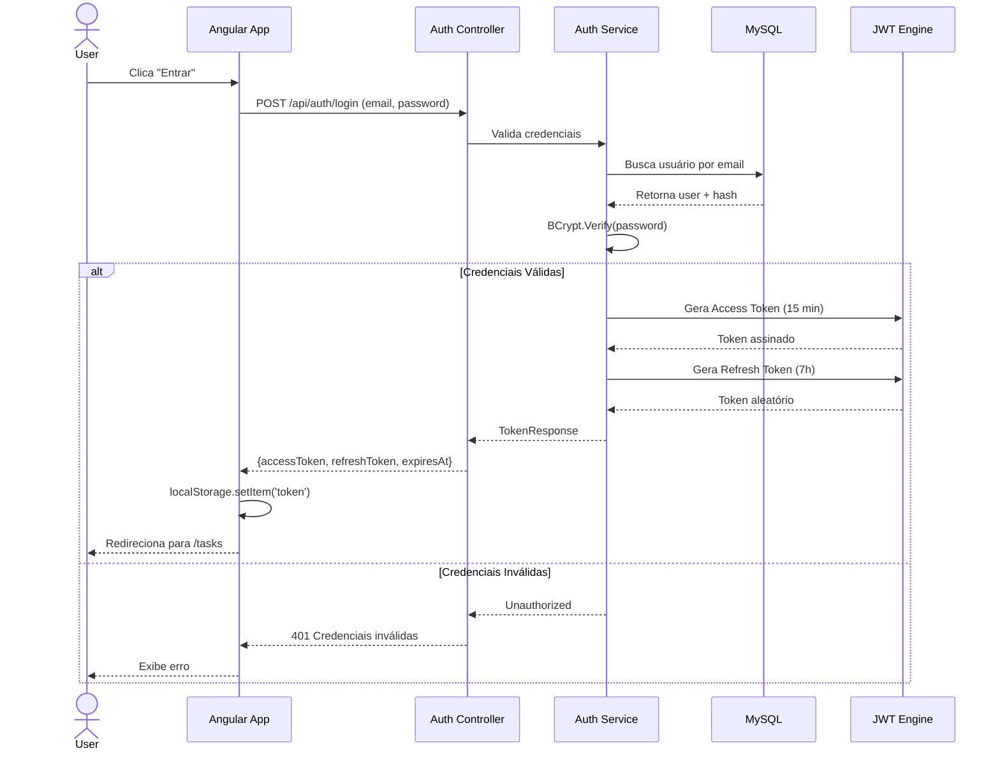
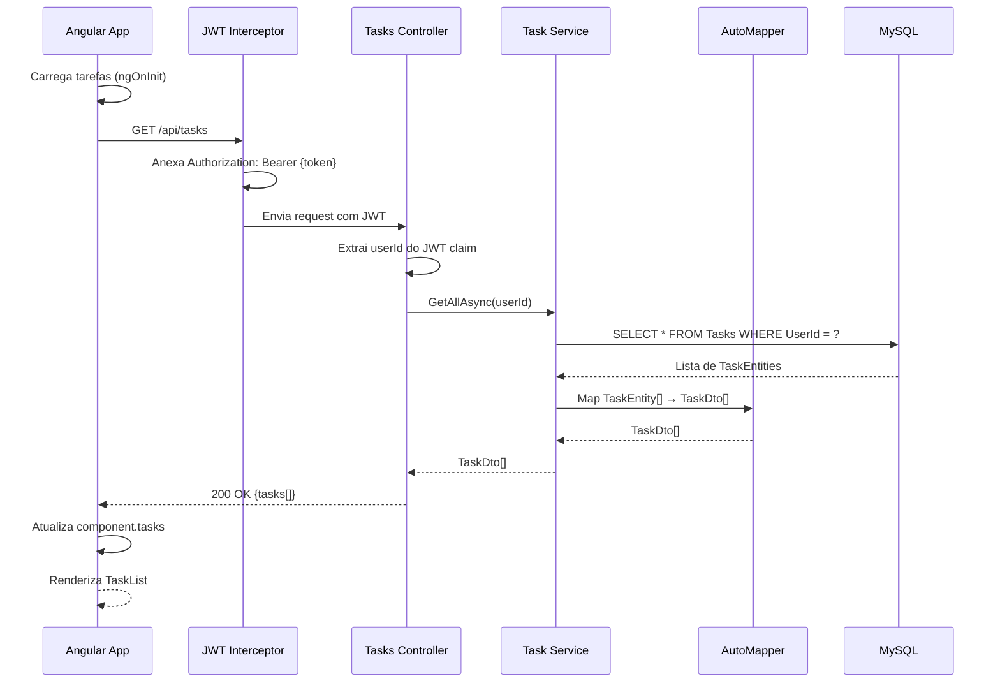

# Diagrama Arquitetural - Task Manager

## Visão Geral da Solução



---

## Fluxo de Requisição - Autenticação



---

## Fluxo de Requisição - Obter Tarefas



---

## Estrutura de Pastas

```
TaskManager/
├── backend/
│   ├── TaskManager.Api/
│   │   ├── Controllers/
│   │   │   ├── AuthController.cs
│   │   │   └── TasksController.cs
│   │   ├── Middleware/
│   │   │   └── ErrorHandlingMiddleware.cs
│   │   ├── Program.cs
│   │   ├── appsettings.json
│   │   └── TaskManager.Api.csproj
│   ├── TaskManager.Application/
│   │   ├── DTOs/
│   │   ├── Interfaces/
│   │   ├── Services/
│   │   ├── Profiles/
│   │   ├── Validators/
│   │   └── TaskManager.Application.csproj
│   ├── TaskManager.Domain/
│   │   ├── Entities/
│   │   │   ├── User.cs (+ UserRole enum)
│   │   │   └── TaskEntity.cs
│   │   └── TaskManager.Domain.csproj
│   ├── TaskManager.Infrastructure/
│   │   ├── Data/
│   │   │   ├── AppDbContext.cs
│   │   │   └── RefreshTokenStore.cs
│   │   ├── Migrations/
│   │   ├── Repositories/
│   │   ├── Seed/
│   │   └── TaskManager.Infrastructure.csproj
│   └── TaskManager.Tests/
│       ├── TaskServiceTests.cs
│       └── TaskManager.Tests.csproj
│
├── frontend/
│   └── task-manager-frontend/
│       ├── src/
│       │   ├── app/
│       │   │   ├── app.component.ts (navbar + router)
│       │   │   ├── app.routes.ts
│       │   │   ├── pages/
│       │   │   │   ├── login/
│       │   │   │   └── tasks/
│       │   │   ├── components/
│       │   │   │   ├── task-list/
│       │   │   │   └── task-form/
│       │   │   ├── services/
│       │   │   │   ├── api.service.ts
│       │   │   │   └── auth.service.ts
│       │   │   ├── guards/
│       │   │   │   └── auth.guard.ts
│       │   │   ├── interceptors/
│       │   │   │   ├── jwt.interceptor.ts
│       │   │   │   └── error.interceptor.ts
│       │   │   └── models/
│       │   │       └── task.model.ts
│       │   ├── main.ts
│       │   ├── index.html
│       │   └── styles.css (Tailwind)
│       ├── package.json
│       ├── tailwind.config.js
│       └── angular.json
│
└── docs/
    ├── architecture.md
    ├── API_EXAMPLES.md
    └── DIAGRAM.md (este arquivo)
```

---

## Stack Tecnológico

### Frontend
- **Framework**: Angular 19+ (Standalone Components)
- **Styling**: Tailwind CSS
- **HTTP**: HttpClient + RxJS
- **Forms**: Reactive Forms (FormBuilder, Validators)
- **Routing**: Angular Router com AuthGuard
- **Interceptors**: JWT + Error Handler

### Backend
- **Runtime**: .NET 8
- **Framework**: ASP.NET Core Web API (Minimal APIs)
- **ORM**: Entity Framework Core 9.0
- **Database**: MySQL 8.0+
- **Auth**: JWT Bearer + Refresh Tokens
- **Validation**: FluentValidation
- **Mapping**: AutoMapper
- **Logging**: ILogger (ASP.NET Core built-in)
- **Testing**: xUnit

### Arquitetura
- **Padrão**: Layered Architecture (API, Application, Domain, Infrastructure)
- **SOLID**: DI, SRP, ISP
- **Segurança**: CORS, JWT, BCrypt
- **Error Handling**: Global middleware + HTTP interceptors
- **Database**: Migrations automáticas com EF Core

---

## Endpoints Disponíveis

| Method | Endpoint | Auth | Descrição |
|--------|----------|------|-----------|
| POST | `/api/auth/login` | ❌ | Autentica usuário e retorna tokens |
| POST | `/api/auth/refresh` | ❌ | Renova access token usando refresh token |
| GET | `/api/tasks` | ✅ | Lista todas as tarefas do usuário |
| GET | `/api/tasks/{id}` | ✅ | Obtém detalhes de uma tarefa |
| POST | `/api/tasks` | ✅ | Cria nova tarefa |
| PUT | `/api/tasks/{id}` | ✅ | Atualiza tarefa |
| DELETE | `/api/tasks/{id}` | ✅ | Deleta tarefa |

---

## Fluxo de Ciclo de Vida

1. **Inicialização Frontend**
   - `main.ts` → bootstrapApplication
   - Registra rotas, HTTP interceptors, provedores
   - AuthService verifica localStorage por token existente

2. **Login**
   - Usuário acessa `/login`
   - Envia credenciais → Backend valida
   - Recebe `accessToken` + `refreshToken`
   - Armazena em localStorage
   - Redireciona para `/tasks`

3. **Requisição Protegida**
   - JwtInterceptor anexa `Authorization: Bearer {token}`
   - Backend valida JWT signature
   - Extrai userId do claim `sub`
   - Processa requisição com escopo do usuário

4. **Expiração de Token**
   - Frontend detecta 401 via ErrorInterceptor
   - Chama `/api/auth/refresh` com refreshToken
   - Obtém novo accessToken
   - Retenta requisição original
   - Se refresh falhar → logout + redireciona para /login

5. **Encerramento**
   - Usuário clica "Logout"
   - `AuthService.logout()` limpa localStorage
   - ErrorInterceptor redireciona para /login

---

## Segurança

```
┌─────────────────────────────────────────────────────┐
│                  CAMADAS DE SEGURANÇA                │
├─────────────────────────────────────────────────────┤
│ 1. CORS Policy → Apenas localhost:4200 permitido    │
│ 2. JWT Bearer → Todas requisições (exceto login)    │
│ 3. BCrypt → Hashing de senhas (admin@/Admin@123)    │
│ 4. AuthGuard → Proteção de rotas no frontend        │
│ 5. [Authorize] → Proteção de endpoints no backend   │
│ 6. Refresh Tokens → Renovação segura de access      │
│ 7. Error Handling → Sem exposição de stack traces   │
└─────────────────────────────────────────────────────┘
```

---

## Escalabilidade Futura

- [ ] Implementar banco de dados para refresh tokens (segurança)
- [ ] Adicionar caching (Redis) para tarefas frequentes
- [ ] Rate limiting nos endpoints (preventivo de abuso)
- [ ] Auditoria de ações (log em DB)
- [ ] Suporte a múltiplos usuários com compartilhamento de tarefas
- [ ] WebSockets para notificações real-time
- [ ] CI/CD (GitHub Actions / Azure Pipelines)
- [ ] Docker + Kubernetes
- [ ] API Versioning (v1, v2, etc.)
- [ ] OpenAPI/Swagger documentation